
<i>Data science capstone project mining open source code for insights, built in <b>2 weeks</b></i>

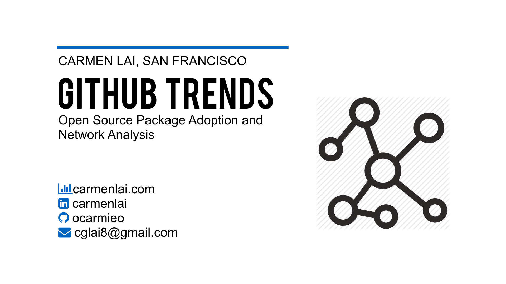

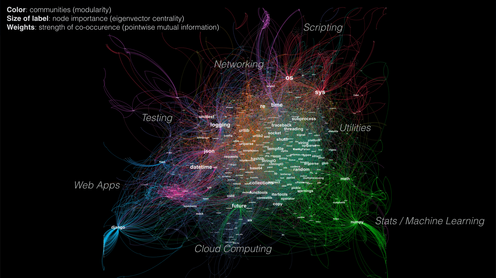
<h4 align="center">Figure 1. The Python package universe, compared to those taught at Galvanize.</h4>

## Table of Contents
1. [Motivation](#1-motivation)
2. [The Database](#2-the-database)
    * [2.1 Time Series Data](#21-time-series-data)
    * [2.1 Network Data](#22-network-data)
3. [Interactive Visualization of Usage Trends](#3-interactive-visualization-of-usage-trends)
4. [Network Analysis and Recommender](#4-network-analysis-and-recommender)
	* [4.1 Edge Weights](#41-edge-weights)
	* [4.2 Node Importance](#42-node-importance)
	* [4.3 Node Similarity](#43-node-similarity)
	* [4.4 Communities](#44-communities)
5. [Text Mining and Prediction](#5-text-mining-and-prediction) 
6. [The Web App](#6-the-web-app)
7. [About the Author](#7-about-the-author)
8. [References](#8-references)

## 1 Motivation
Open source software has accelerated innovation and enabled collaboration for people and organizations all over the world. However, __discoverability__ of new technologies has not caught up with its fast-growing availability. As a result, finding new packages is a challenge for learners who may be new to a topic or to coding entirely. Package managers like pip and Anaconda provide a rich index of packages, but are not as helpful in exposing users to new packages.

__GitHub__ [recently](https://github.com/blog/2201-making-open-source-data-more-available) made activity data for over 3 million open source repositories available on Google BigQuery, making it one of the largest datasets on collaboration. 

> “Just as books capture thoughts and ideas, software encodes human knowledge in a machine-readable form. This dataset is a great start toward the pursuit of documenting the open source community's vast repository of knowledge.” -- GitHub blog

__GitHub Trends__ was created by mining open source code for insights on open source package adoption and relationships within a network. Use cases include:
+ Helping users compare packages and see which ones are gaining more momentum
+ Recommending new packages that are relevant to packages users may already be using

## 2 The Database
The data I used came from two tables that totaled 2TB in size on BigQuery. The `contents` table included code at the file level, and the `commits` table included timestamps at the commit level. For the scope of this 2-week project, I limited my data to the __Python language__ which is 7% of repos, and used an extract available for [Python contents](https://bigquery.cloud.google.com/table/fh-bigquery:github_extracts.contents_py) that made the joins less massive.

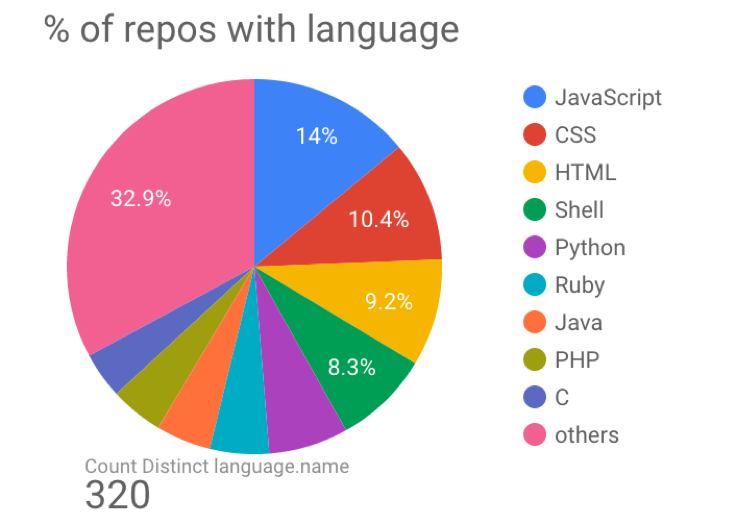
<h4 align="center">Figure 2. Languages used in GitHub repos. [<a href="https://datastudio.google.com/#/org//reporting/0ByGAKP3QmCjLdXBlWVdrZU5yZW8/page/yFI">image source</a>]</h4>

When querying the data, I wanted to take advantage of Google's compute engine and do as much data processing that made sense using SQL on BigQuery prior to exporting the data. This included extracting package imports using regular expressions. My final table had file IDs along with each file's package imports nested.

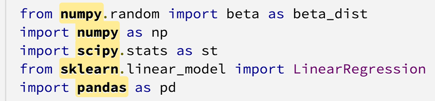
<h4 align="center">Figure 3. Package name extraction from Python code.</h4>

###2.1 Time Series Data
The tricky part in handling dates was that there were both author dates and commit dates (read about their differences [here](https://alexpeattie.com/blog/working-with-dates-in-git)), and multiple values for these dates for each file (multiple diffs). The data did not include file content changes in each diff. I could have chosen the earliest date, latest date, median date, average date, etc. I decided to go with the earliest author date and assumed that the onset of intention to use a package was the most important.
To prepare the data for easy querying on the web app, I stored the count of package imports in a PostgreSQL database, and __set package name and date as indices__ of the table.

###2.2 Network Data
To get the edge (package connections) pairs, I need to count each combination of packages for each file. Doing this in SQL would involve self joins and a lot of computation, so I decided to export the data and use MapReduce to parallelize the process. This could be done for __4 million files in a couple of minutes__ using Amazon EMR (Elastic MapReduce) to split the work across multiple machines.

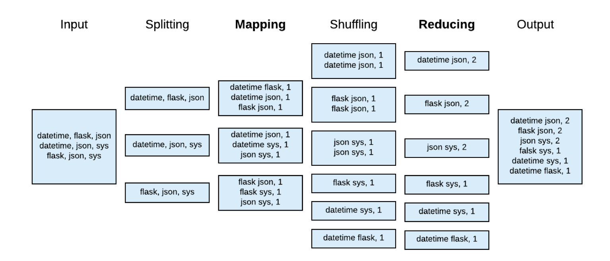
<h4 align="center"> Figure 4. MapReduce to parallelize computation for edge counts.</h4>

## 3 Interactive Visualization of Usage Trends

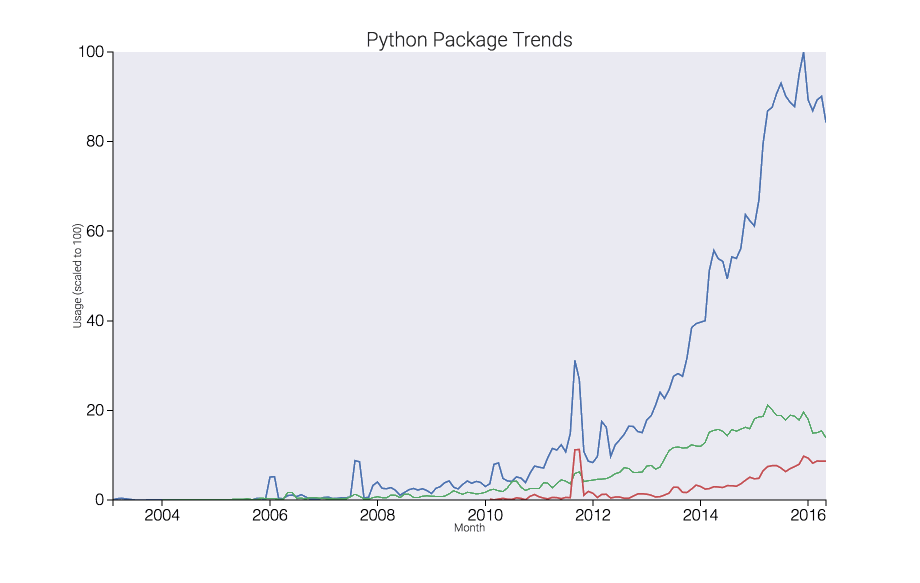
<h4 align="center"> Figure 5. Interactive plot created using mpld3.</h4>

For the time series portion of the web app, users can input a list of packages and the app will return an interactive plot created using mpld3. __Similar to Google Trends, the highest value on the plot is set to 100__ and the other values are scaled proportionally for comparison on a relative basis.

This plot was made using [`mpld3`](https://mpld3.github.io/), a Python toolkit that enables you to write code for `matplotlib`, and then export the figure to HTML code that renders in __D3__, a JavaScript library for interactive data visualizations.

## 4 Network Analysis and Recommender

The network of packages had 60,000 nodes and 850,000 edges after I removed pairs that occured less than 5 times. I used [`networkx`](https://networkx.github.io/documentation/networkx-1.10/tutorial/index.html) in Python to organize the network data, node attributes, and edge attributes into a .gml file that can be read into [Gephi](https://gephi.org/) for __visualization__. I used [`igraph`](http://igraph.org/python/doc/igraph.Graph-class.html) in Python to power the __recommender__.

The goal of the project is __to expose packages that may not be the most widely used, but are the most relevant and have the strongest relationships__. Metrics like __pointwise mutual information__, __eigenvector centrality__, and __Jaccard similarity__ were chosen to highlight strong relationships even for less popular packages.

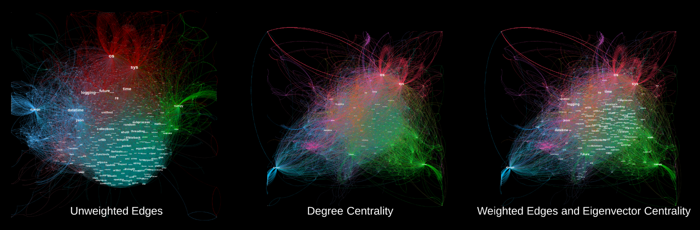
<h4 align="center">Figure 6. Influence of edge weights and centrality metric on network visualization.</h4>

###4.1 Edge Weights
Edge weights represent the strength of a relationship between two packages. However, if I simply determined the strength of a relationship based on edge counts (number of times they co-occur), smaller packages would get overshadowed by large packages even if they had a stronger relationship. Instead, I decided to use __pointwise mutual information (PMI)__, which not only takes into the joint probability of 2 packages occuring, but also their individual probabilities. This value can be normalized between [-1,+1].

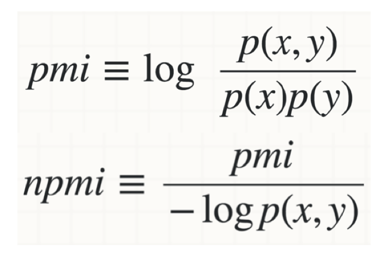

To visualize the network, I used a __force-directed layout__ in Gephi called ForceAtlas 2, which took into account the edge weights in the calculation of attraction and repulsion forces. Packages with a strong relationship attract, while packages with weak or no relationship repel. Gephi has [different layouts](https://gephi.org/tutorials/gephi-tutorial-layouts.pdf) depending on what features you want to highlight.

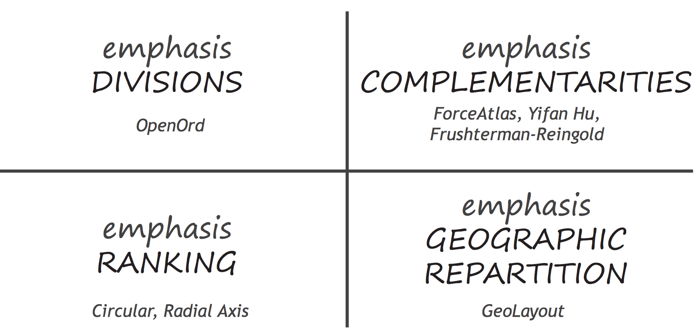
<h4 align="center">Figure 7. Network layouts and topology in Gephi.</h4>

###4.2 Node Importance

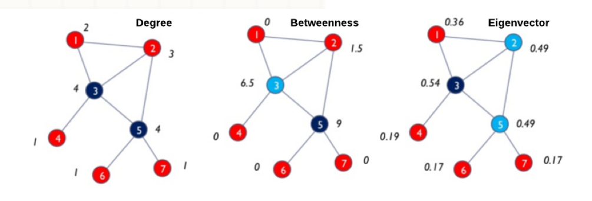
<h4 align="center">Figure 8. Comparison of different centrality metrics on the same graph. [<a href="http://www.slideshare.net/gcheliotis/social-network-analysis-3273045">image source</a>]</h4>

A few different metrics can be used to determine node importance: degree centrality, betweenness centrality, and eigenvector centrality. They are proportional to the following (prior to normalization):
+ __Degree__: number of neighbors a node has
+ __Betweenness__: number of shortest paths throughout the network that pass through a node
+ __Eigenvector__: sum of a node's neighbors' centralities

Degree centrality made most packages disappear with the exception of the big ones that are more generally used (`os`, `sys`). Betweenness centrality had a similar result, likely influenced by the edge weights. __Eigenvector centrality__ looked the best visually and made the most sense in terms of the objectives of this project: __to recommend packages that may not be the most widely used, but are the most relevant__. The assumption is that a node's importance depends more on the quality of its connections rather than the quantity. Google's PageRank algorithm used to order search engine results is a variant of eigenvector centrality.

###4.3 Node Similarity
To make similarity recommendations for a given package of interest, I want to identify neighboring packages that are _structurally_ similar in the network. I used __Jaccard similarity__ to rank a list of a node's first degree neighbors as recommendations for most _similar_ packages, which is calculated by the number of common neighbors divided by the union of the neighbors of both packages. This metric determines node similarity __in context of the network structure, rather than just individual node attributes.__

Jaccard similarity is used for ranked recommendations alongside pointwise mutual information ("weighted co-occurence"), and a raw edge count. I found that the raw count typically returns recommendations that are more generally popular, while the left two metrics return more highly relevant or specific packages. In the example below for `networkx` (a package for network analysis), top recommended packages include `Bio` (computational biology), `nltk` (natural language processing), and `pycxsimulator` (dynamic graph simulation), all of which point to more specific use cases for `networkx`.

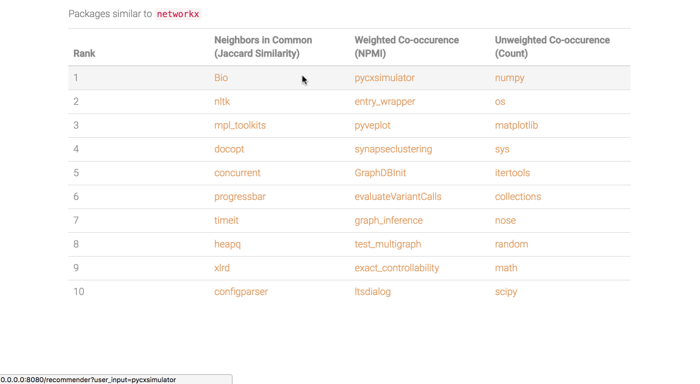
<h4 align="center">Figure 9. Screenshot from the network-based recommender app. [<a href="#6-the-web-app">see demo</a>]</h4>

###4.4 Communities
__Modularity__ is a measure of how densely connected a community is based on the number of edges that are _within_ a community compared to the _expected_ number that would exist at random, holding the number of degrees constant. A community should have denser connections within itself and sparser connections to other communities. Gephi allows you to color nodes based on "Modularity Class." You can tweak the community detection algorithm resolution to show more of fewer communities.

|__Importance Ranking (by eigencentrality)__|__Scripting / Testing__|__Web Apps__|__Math / Machine Learning__|__Utilities__|__Cloud Computing__|
|-|--|--------|--------------|-----------|----|
|1|os|DateTime|\_\_future\_\_|collections|uuid|
|2|sys|json|numpy|random|six|
|3|time|django|math|subprocess|mock|
|4|logging|flask|matplotlib|traceback|sqlalchemy|
|5|re|util|scipy|urllib|eventlet|
|6|unittest|nose|pandas|ConfigParser|abc|
|7|pytest|pytz|sklearn|threading|nova|
|8|PyQt4|xmodule|pylab|tempfile|oslo_config|

<h4 align="center">Table 1. Top five communities via modularity, with human-assigned labels.</h4>

## 5 Text Mining and Prediction
Analysis of package description text coming soon!

## 6 The Web App
The web app consists of two components:
+ __Interactive visualization of package usage trends__

+ __Network-based recommender of similar or relevant packages__ - allows users to traverse through the network based on similarity or relevance
    * Ranked recommendations from Jaccard similarity and normalized pointwise mutual information tend to return packages that may be less widely used but are more highly relevant, while those from a raw count are more generally popular packages

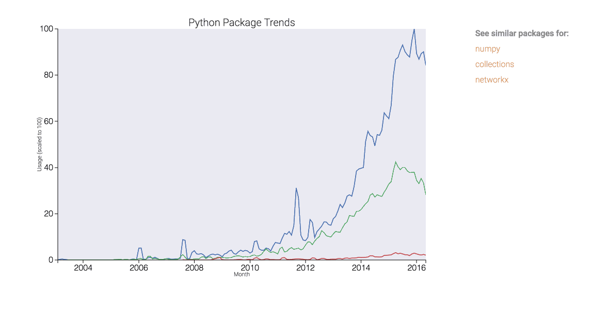

Currently working to add package descriptions and topics. __Live app coming soon - stay tuned!__

## 7 About the Author

**Carmen Lai** is a data scientist in San Francisco with a background in neuroscience and industry experience in marketing analytics and strategy consulting. She is interested in using statistical modeling and machine learning techniques to drive product growth and greater understanding of users. You can reach her on [LinkedIn](https://www.linkedin.com/in/carmenlai).

## 8 References

1. [*"BigQuery Dataset: GitHub Repos"*](https://bigquery.cloud.google.com/dataset/bigquery-public-data:github_repos).

2. [*"Visualizing Relationships Between Python Packages"*](https://kozikow.com/2016/07/10/visualizing-relationships-between-python-packages-2/), blog by Robert Kozikowski.

3. [*"Social Network Analysis (SNA): Tutorial on Concepts and Methods"*](http://www.slideshare.net/gcheliotis/social-network-analysis-3273045), presentation by Dr. Giorgos Cheliotis, National University of Singapore.

4. Leicht E.A., Holme P., Newman M.E.J., 2016. [*"Vertex similarity in networks"*](http://www.leonidzhukov.net/hse/2016/networks/papers/VertexSimilarity_Newman.pdf). Physical Review E 73 (2), 026120.
